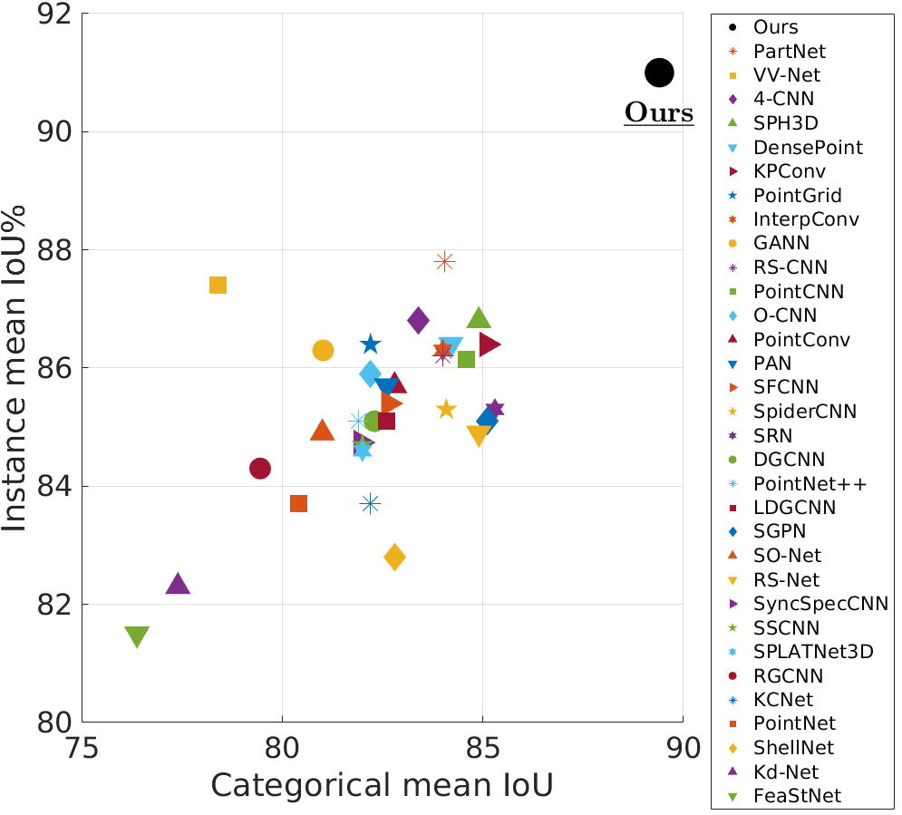

# Learning to Segment 3D Point Clouds in 2D Image Space

## Overview
In contrast to the literature where local patterns in 3D point clouds are captured by customized convolutional operators, in this paper we study the problem of how to effectively and efficiently project such point clouds into a 2D image space so that traditional 2D convolutional neural networks (CNNs) such as U-Net can be applied for segmentation. To this end, we are motivated by graph drawing and reformulate it as an integer programming problem to learn the topology-preserving graph-to-grid mapping for each individual point cloud. To accelerate the computation in practice, we further propose a novel hierarchical approximate algorithm. With the help of the Delaunay triangulation for graph construction from point clouds and a multi-scale U-Net for segmentation, we manage to demonstrate the state-of-the-art performance on ShapeNet and PartNet, respectively, with significant improvement over the literature. 



##

## Conda environment setup
```
conda create -n XYZNet
conda activate XYZNet
conda install python=3.6 tensorflow-gpu=1.14 scikit-learn scipy networkx keras
```

## Download the ShapeNet part dataset
```
sh download_data.sh
```

## Prepare training and testing dataset
```
python data_preparation_training.py
python data_preparation_testing.py
```

## Train the network
```
python network_training.py
```

## Test the network
```
python network_testing.py
```

## Citation
```
@inproceedings{lyu2020learning,
  title={Learning to Segment 3D Point Clouds in 2D Image Space},
  author={lyu, Yecheng and Huang, Xinming and Zhang, Ziming},
  booktitle={Computer Vision and Pattern Recognition (CVPR)},  
  year={2020}  
}
```
